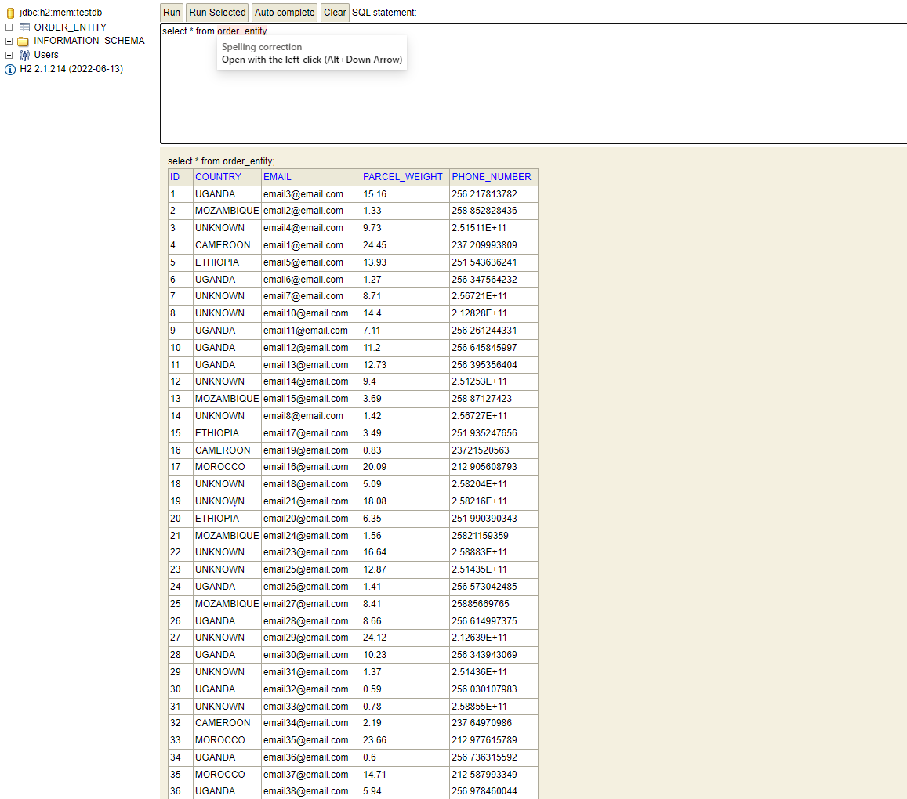
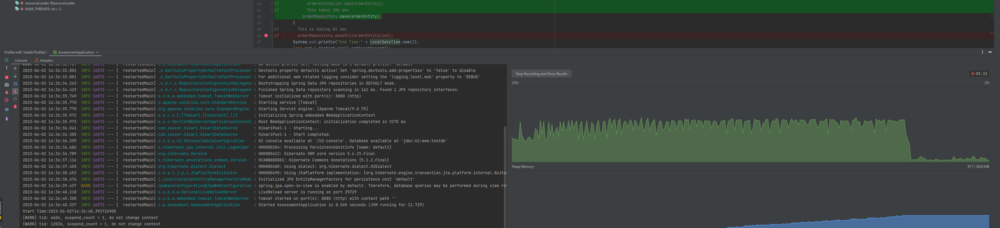
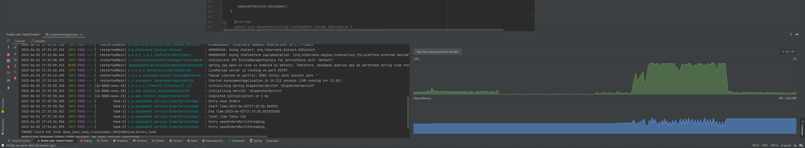

# Order Processing

This project implements a Java Spring Boot application for processing a CSV file containing orders and persisting them in a database. The application utilizes multithreading to efficiently handle a large number of records.

## Table of Contents

- [Features](#features)
- [Technologies](#technologies)
- [API](#api)
- [Setup](#setup)
- [Usage](#usage)
- [Contributing](#contributing)
- [License](#license)

## Features

- Reads a CSV file and splits the orders based on the country determined by the client's phone number using regular expressions.
- Persists the orders in a database using Java Spring Boot and JPA.

## Technologies

- Java 8
- Spring Boot
- Spring Data JPA
- H2 Database
- Maven

## API

- /v1/orders: process the data in single thread. (this is a little slower)
- /v2/orders: process the data using multithreading.( this takes less time for persisting the data to db)

## Setup

1. Clone the repository:

```shell
git clone https://github.com/your-username/csv-processing-persistence.git
````

2. Download the excel file from this [link](https://docs.google.com/spreadsheets/d/1k5pPRx95OBRYegBwbTNanedcDmcwPkAs/edit?usp=sharing&ouid=116994843436259547149&rtpof=true&sd=true) and convert it to csv. copy it to resource folder.

3. Execute the below command

```shell
mvn clean install
```

4. Run the main application. ```AssessmentApplication.jsva```.


5. Application runs in port 8080 by default. To verify if data is written to h2 db. Navigate to http://localhost:8080/h2-console/.

- credentials:
- username: sa
- password: 
- db: jdbc:h2:mem:testdb

## Output



## Performance with Single Thread



## Performance with multithreading




